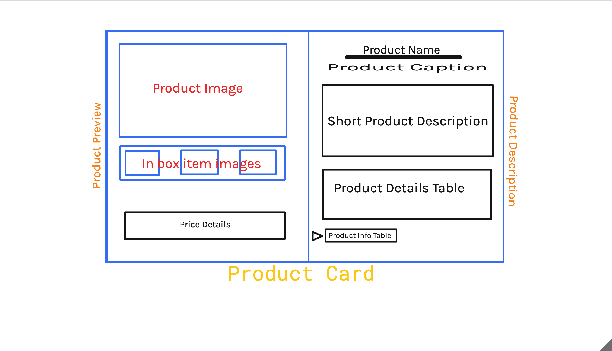
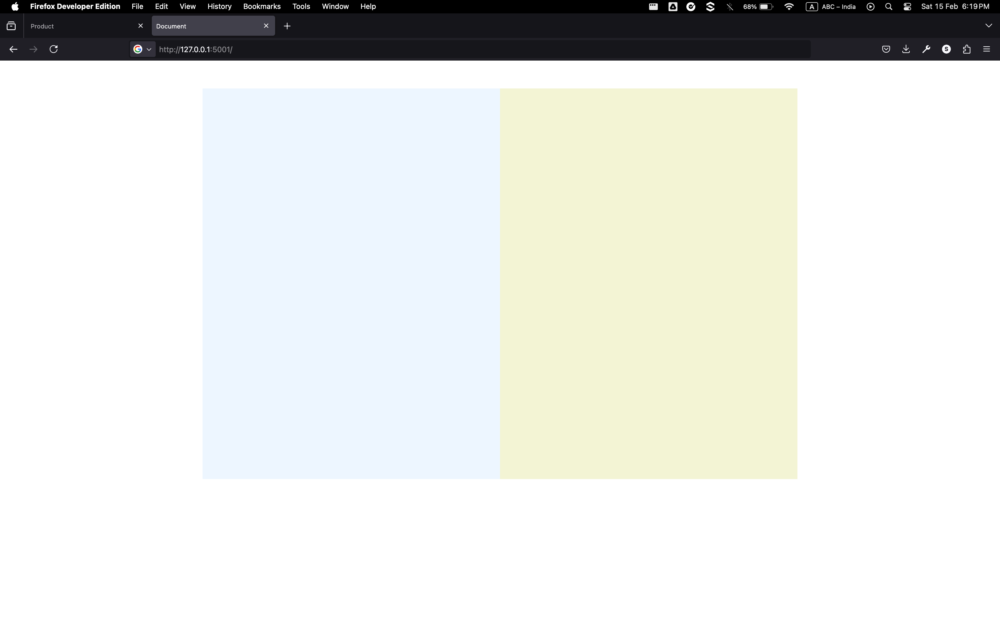
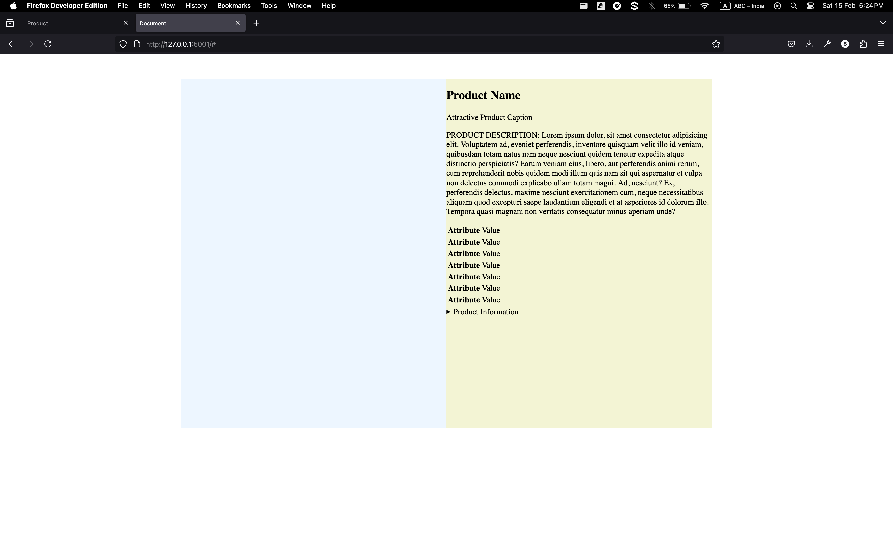
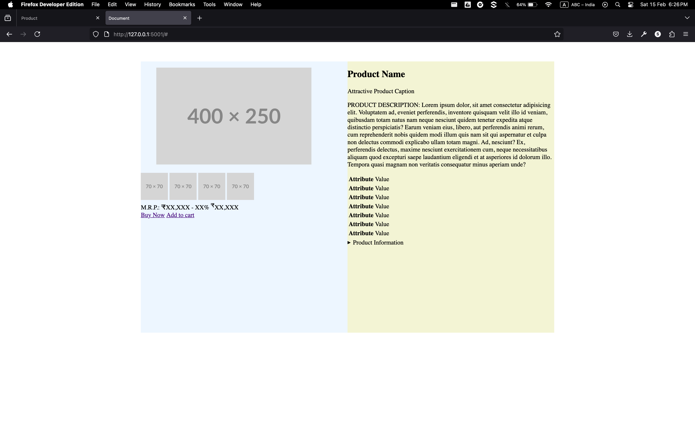
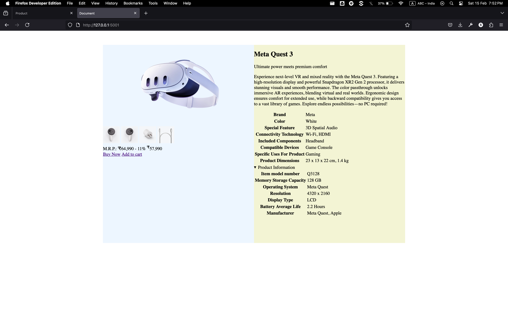
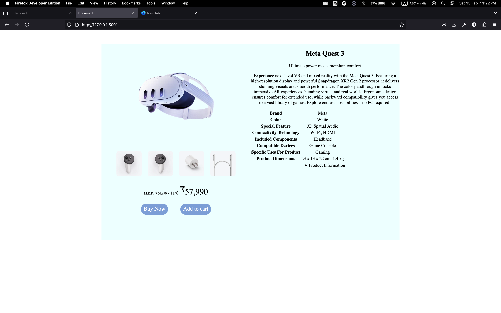
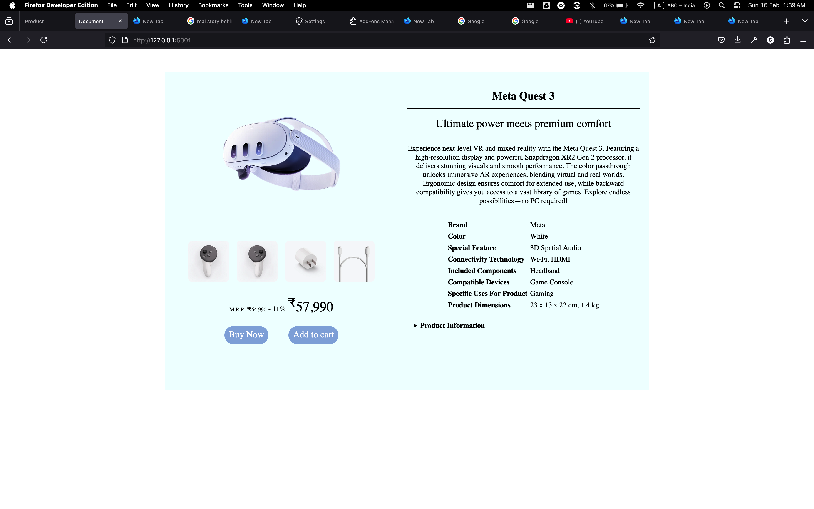

# product-card
product card practice

# Layout

# Progress

## After 1st commit
Product card base layout implemented

## After 2nd commit
Base layout of Product description implemented without styling and contents filled with random data

## After 3rd commit
Base layout of Product preview implemented without styling and contents filled with random data and blank place holders

## After 6th commit
Applied the actual product data, assets added. No style implemented.

## After 8th commit
Applied style to the components of the product preview part.

## After 9th commit
Applied style to the components of the product description part.

